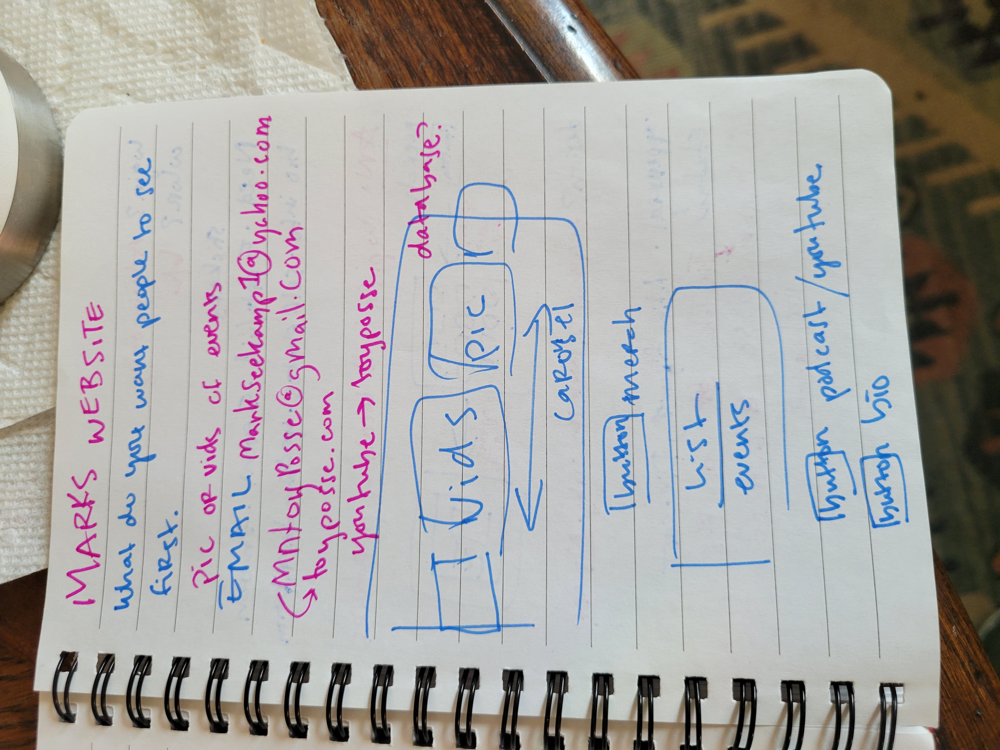
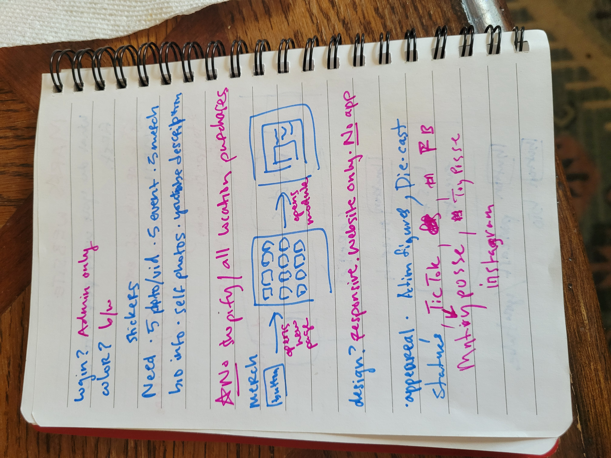

# Toy Posse

[trello](https://trello.com/b/PlOYcSwt/toy-posse)

[figma](https://www.figma.com/file/fAFTnBYWUI7vYXeFN5yLYw/toy-posse?type=design&node-id=0-1&mode=design&t=C2ybN4PfWrLCOyR6-0)

[MUI docs](https://mui.com/material-ui/all-components/)

## Learn More

You can learn more in the [Create React App documentation](https://facebook.github.io/create-react-app/docs/getting-started).

To learn React, check out the [React documentation](https://reactjs.org/).
